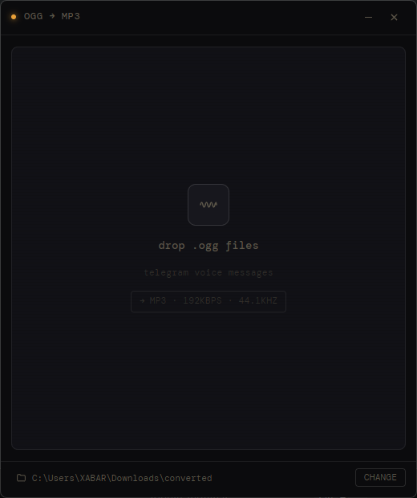

# ogg-converter

Drag-and-drop desktop app for converting Telegram voice messages (`.ogg`) to MP3.

Built with Electron + React. Uses your system `ffmpeg` — no bundled binaries.



---

## Requirements

- **ffmpeg** in your PATH

  ```sh
  # macOS
  brew install ffmpeg

  # Windows
  winget install ffmpeg
  ```

- Node 18+

## Usage

Drop `.ogg` files onto the window. Converted MP3s land in `~/Downloads/converted` by default — you can change that in the footer.

When a file is done, it will appear in Finder / Explorer.

## Development

```sh
npm install
npm run dev
```

## Building

```sh
npm run dist:win   # → dist/*.exe (NSIS installer)
npm run dist:mac   # → dist/*.dmg
```

## Output settings

192 kbps · 44.1 kHz · stereo. Hardcoded for now — Telegram voice notes don't benefit from higher bitrates.

## Platform support

| Platform | Status |
|----------|--------|
| Windows 10/11 | ✅ |
| macOS 12+ | ✅ |
| Linux | should work, untested |

## macOS tray

Menu bar drop target is stubbed out (`// TODO` in `src/main/index.ts`). PRs welcome.

## License

MIT
